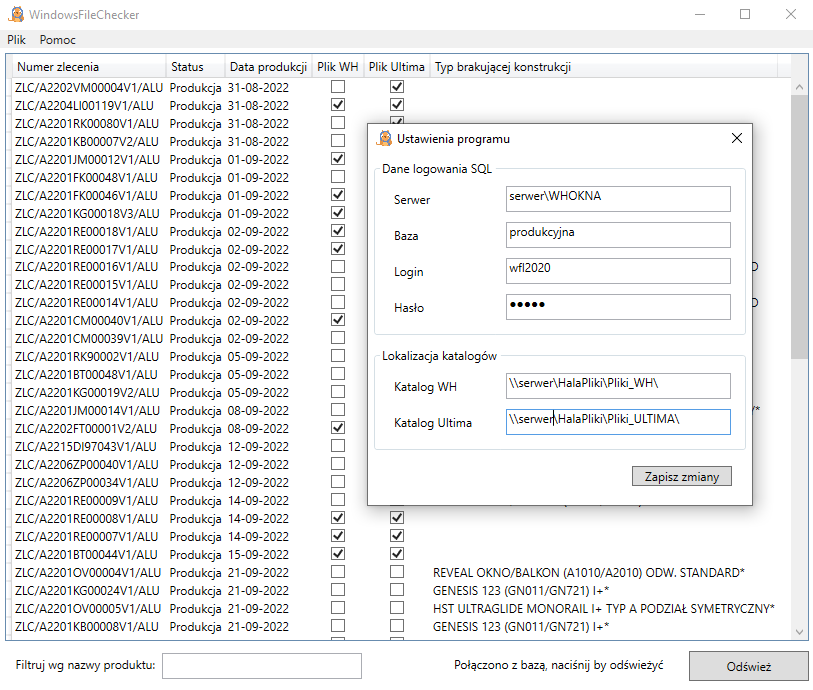

# FileChecker

App created for production management in a window manufacturing company.

## Table of contents
* [General info](#general-info)
* [Technologies](#technologies)
* [Setup](#setup)

## General info
WindowsFileChecker is the window application that helps to control the preparation of
CNC machines and production lines for incoming orders.

The application retrieves the closest orders from the production MSSQL database 
and checks if batch files are generated for them from different machine control programs - WHOkna and UniLink.

Project contains also the first version of FileChecker - ConsoleFileChecker 
that does the same but displays the results to the console.

## Technologies

.NET 6.0
WPF

## Setup

Build the project in Visual Studio
